# Лабораторная работа №7: Создание многоконтейнерного приложения

---

## Студент

- **Имя и Фамилия**: Никита Савка  
- **Группа**: I2302  
- **Платформа**: macOS (Apple M3)  
- **Дата выполнения**: 5 марта 2025  

---

## Цель работы

Ознакомиться с работой многоконтейнерного приложения на базе **docker-compose**. В данной работе я разверну **PHP-приложение**, состоящее из трёх контейнеров:  
- **Nginx** – для обработки HTTP-запросов;  
- **PHP-FPM** – для выполнения PHP-кода;  
- **MariaDB** – для хранения данных базы.  

**Основные особенности**:  
- Использование **docker-compose** для управления контейнерами.  
- Монтирование локальных файлов сайта (PHP-код) в контейнеры.  
- Использование локальных конфигурационных файлов (например, для Nginx).  
- Организация внутренней сети для обеспечения связи между контейнерами.  

---

## Задание

1. Создать репозиторий `containers07` и склонировать его на компьютер.  
2. В директории проекта создать структуру:  
   - `mounts/site` – для файлов PHP-сайта.  
   - `nginx/default.conf` – конфигурационный файл для Nginx.  
3. Создать файл `.gitignore` для исключения папки `mounts/site` из репозитория.  
4. Создать файл `docker-compose.yml` для описания трёх сервисов (frontend, backend, database).  
5. Создать файл `mysql.env` с переменными окружения для базы данных.  
6. (Дополнительно) Создать файл `app.env` с переменной `APP_VERSION` для сервисов backend и frontend.  
7. Запустить контейнеры командой `docker-compose up -d` и проверить работу сайта по адресу [http://localhost](http://localhost).  
8. Ответить на следующие вопросы:  
   - В каком порядке запускаются контейнеры?  
   - Где хранятся данные базы данных?  
   - Как называются контейнеры проекта?  
   - Как добавить файл `app.env` с переменной окружения `APP_VERSION` для сервисов backend и frontend?  

---

## Ход выполнения

### 1. Подготовка репозитория

1. **Создание репозитория на GitHub**:  
   - Я создал публичный репозиторий с именем `containers07` на GitHub.  
   - *Скриншот*:  
     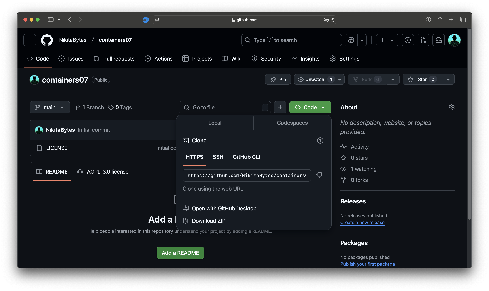  

2. **Клонирование репозитория на компьютер**:  
   - Открыл терминал и выполнил:  
     ```bash
     cd ~/Projects
     git clone https://github.com/NikitaBytes/containers07.git
     cd containers07
     ```  
   - *Разбор*:  
     Команда `git clone` копирует репозиторий с GitHub в локальную директорию, а команда `cd` перемещается в папку проекта.  
   - *Скриншот*:  
     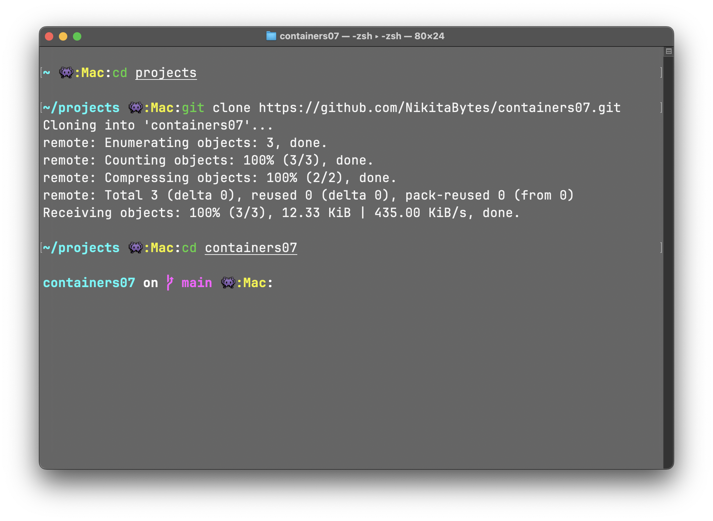  

---

### 2. Создание структуры проекта

1. **Создание директории для сайта**:  
   - Я создал директорию для хранения файлов сайта:  
     ```bash
     mkdir -p mounts/site
     ```  
   - *Разбор*:  
     `mkdir -p` создаёт папку `mounts/site`. Флаг `-p` позволяет создать все родительские каталоги, если их ещё нет.   

2. **Перенос PHP-сайта в `mounts/site`**:  
   - Я перенёс свой PHP-сайт (например, файл `index.php`) в созданную папку:  
     ```bash
     cp -r /Users/nikita_a/Downloads/PHP/lab3_arrays_functions/index.php mounts/site/
     ```  
   - *Разбор*:  
     Команда `cp -r` рекурсивно копирует файл или папку из указанного пути в `mounts/site`.  
   - *Скриншот*:  
     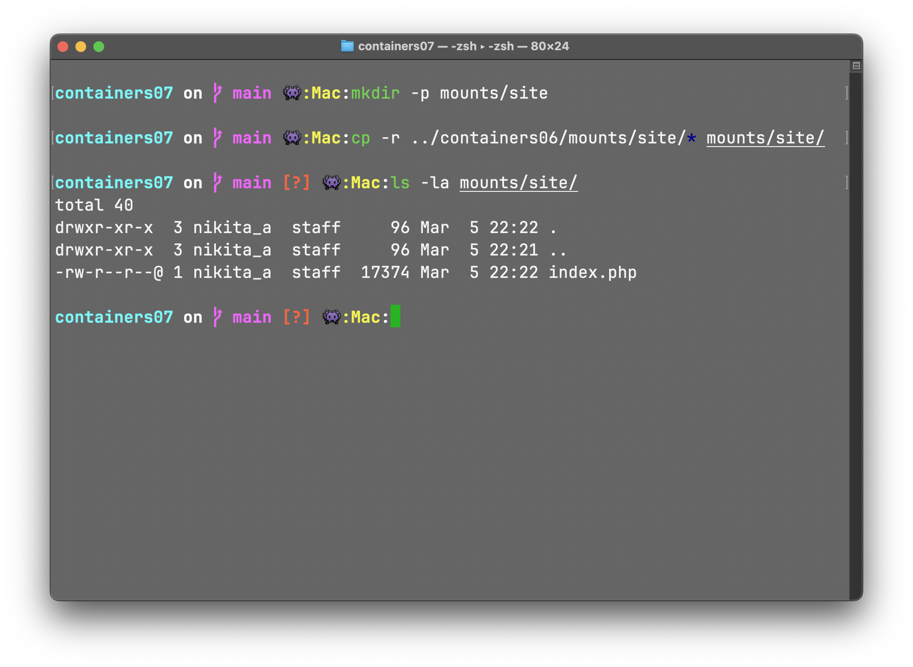  

3. **Настройка файла `.gitignore`**:  
   - Создаю файл `.gitignore`:  
     ```bash
     touch .gitignore
     ```  
   - Добавляю правило, чтобы игнорировать содержимое директории `mounts/site`:  
     ```bash
     echo "mounts/site/*" >> .gitignore
     ```  
   - Проверяю содержимое:  
     ```bash
     cat .gitignore
     ```  
   - *Разбор*:  
     Правило `mounts/site/*` означает, что все файлы и папки внутри `mounts/site` не будут отслеживаться Git, что позволяет избежать загрузки изменяющихся файлов сайта.  
   - *Скриншот*:  
     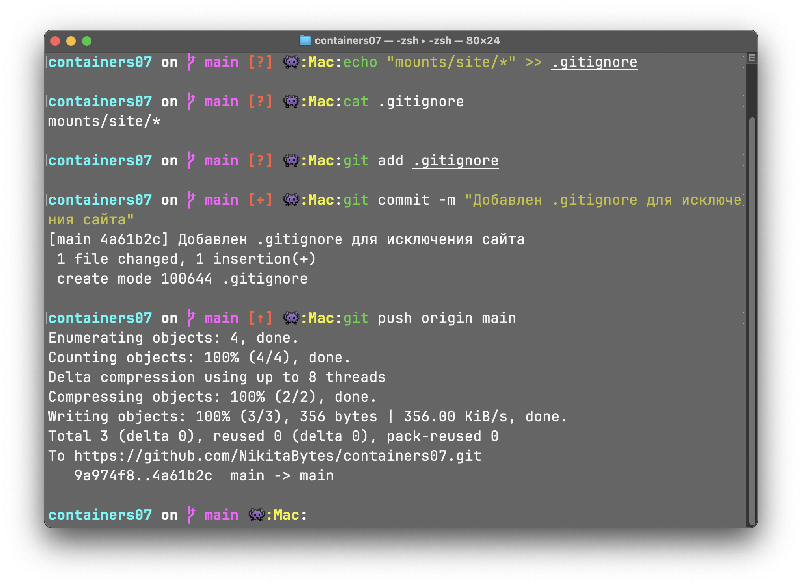  
   - Фиксирую изменения:  
     ```bash
     git add .gitignore
     git commit -m "Добавлен .gitignore для исключения сайта"
     git push origin main
     ```  

---

### 3. Создание конфигурационного файла Nginx

1. **Создание директории для конфигурации Nginx**:  
   - Выполняю команду:  
     ```bash
     mkdir -p nginx
     ```  
   - *Скриншот*:  
     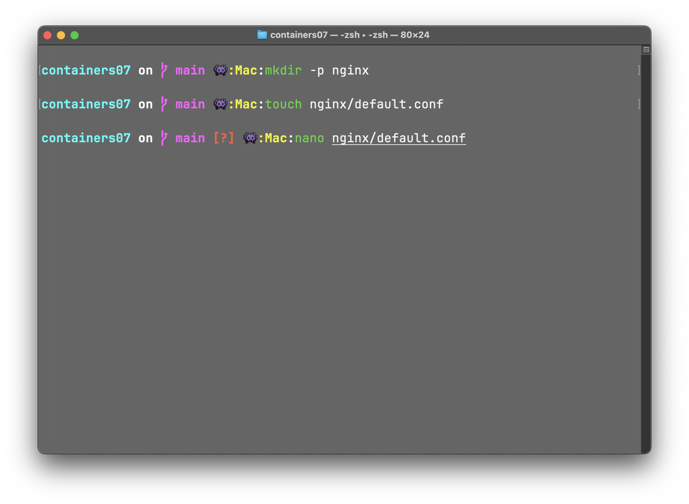  

2. **Создание файла `default.conf`**:  
   - Создаю файл:  
     ```bash
     touch nginx/default.conf
     ```  
   - Открываю файл с помощью `nano`:  
     ```bash
     nano nginx/default.conf
     ```  
   - В редакторе ввожу следующее содержимое:  
     ```nginx
     server {
         listen 80;
         server_name _;
         root /var/www/html;
         index index.php;
         location / {
             try_files $uri $uri/ /index.php?$args;
         }
         location ~ \.php$ {
             fastcgi_pass backend:9000;
             fastcgi_index index.php;
             fastcgi_param SCRIPT_FILENAME $document_root$fastcgi_script_name;
             include fastcgi_params;
         }
     }
     ```  
   - *Разбор*:  
     - **`listen 80;`** – Nginx слушает порт 80.  
     - **`server_name _;`** – применяется для всех доменных имён.  
     - **`root /var/www/html;`** – определяет корневую директорию сайта внутри контейнера.  
     - **`index index.php;`** – указывает, что главным файлом является `index.php`.  
     - **`location / { ... }`** – если запрошенный URI не найден, перенаправляет запрос на `index.php` с параметрами запроса.  
     - **`location ~ \.php$ { ... }`** – все файлы с расширением `.php` обрабатываются через FastCGI:  
       - `fastcgi_pass backend:9000;` – передаёт запрос на контейнер с именем `backend` (PHP-FPM) на порт 9000.  
       - Остальные директивы передают необходимые параметры для обработки PHP.  
   - Сохраняю изменения (`Ctrl + X`, затем `Y`, затем `Enter`).  
   - *Скриншот*:  
     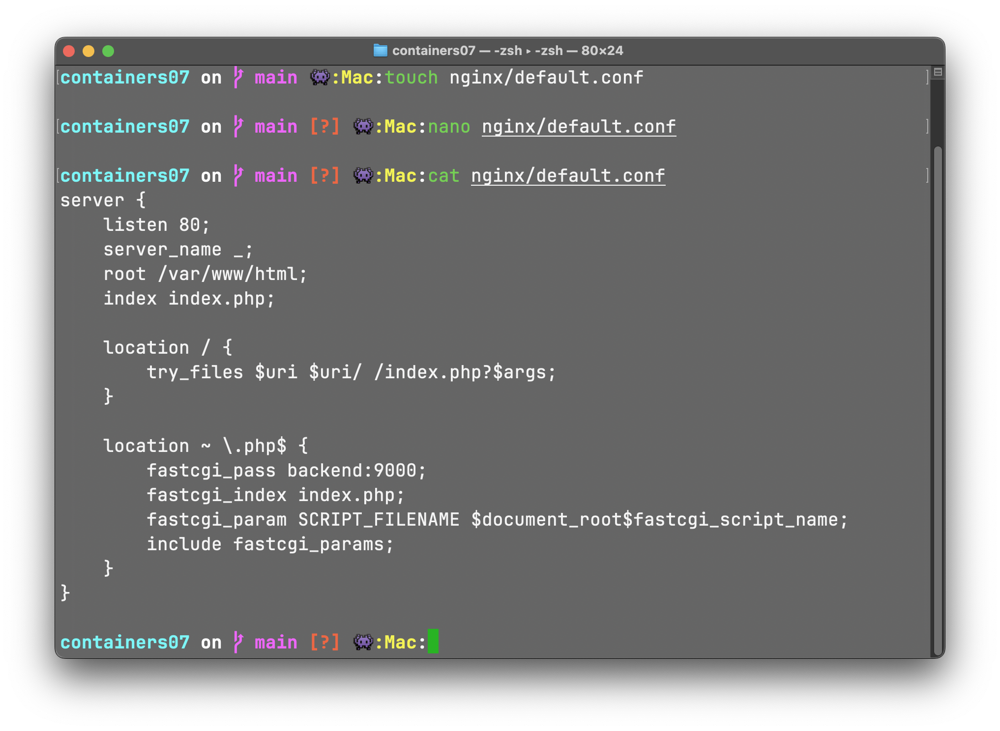  

---

### 4. Создание файла docker-compose.yml

1. **Создание файла**:  
   - Выполняю:  
     ```bash
     touch docker-compose.yml
     nano docker-compose.yml
     ```  

2. **Запись содержимого в файл**:  
   - В редакторе вставляю следующий код:  
     ```yaml
     version: '3.9'

     services:
       frontend:
         image: nginx:1.19
         volumes:
           - ./mounts/site:/var/www/html
           - ./nginx/default.conf:/etc/nginx/conf.d/default.conf
         ports:
           - "80:80"
         networks:
           - internal
         env_file:
           - app.env

       backend:
         image: php:7.4-fpm
         volumes:
           - ./mounts/site:/var/www/html
         networks:
           - internal
         env_file:
           - mysql.env
           - app.env

       database:
         image: mysql:8.0
         env_file:
           - mysql.env
         networks:
           - internal
         volumes:
           - db_data:/var/lib/mysql

     networks:
       internal: {}

     volumes:
       db_data: {}
     ```  
   - *Разбор*:  
     - **Секция services**: описывает три сервиса.  
     - **frontend**: контейнер на базе Nginx, который пробрасывает порт 80 на хост и монтирует как файлы сайта, так и файл конфигурации.  
     - **backend**: контейнер с PHP-FPM, которому монтируется папка сайта.  
     - **database**: контейнер MySQL, где данные сохраняются в томе db_data.  
     - **networks**: создаётся сеть internal для связи контейнеров.  
     - **volumes**: том db_data используется для хранения данных базы.  
   - Сохраняю файл (`Ctrl + X`, затем `Y`, затем `Enter`).  
   - *Скриншот*:  
     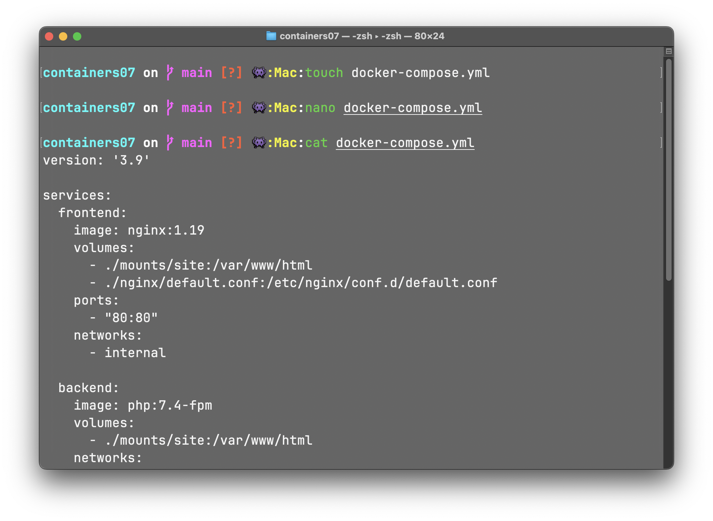  

---

### 5. Создание файла mysql.env

1. **Создание файла**:  
   - Выполняю:  
     ```bash
     touch mysql.env
     nano mysql.env
     ```  

2. **Запись содержимого**:  
   - В редакторе вставляю:  
     ```env
     MYSQL_ROOT_PASSWORD=secret
     MYSQL_DATABASE=app
     MYSQL_USER=user
     MYSQL_PASSWORD=secret
     ```  
   - *Разбор*:  
     Эти переменные задают начальные параметры для контейнера MySQL: пароль root, имя базы, пользователя и его пароль.  
   - Сохраняю файл (`Ctrl + X`, затем `Y`, затем `Enter`).  
   - *Скриншот*:  
     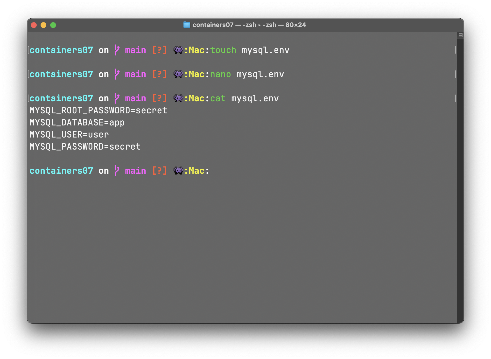  

3. **Добавление файла в .gitignore**:  
   - Чтобы не сохранять файл с паролями в репозитории:  
     ```bash
     echo "mysql.env" >> .gitignore
     ```  

---

### 6. Создание файла app.env

1. **Создание файла**:  
   - Выполняю:  
     ```bash
     touch app.env
     nano app.env
     ```  

2. **Запись содержимого**:  
   - В редакторе вставляю:  
     ```env
     APP_VERSION=1.0.0
     ```  
   - *Разбор*:  
     Файл app.env содержит переменную окружения APP_VERSION, которая будет доступна в контейнерах frontend и backend.  
   - Сохраняю файл (`Ctrl + X`, затем `Y`, затем `Enter`).  
   - *Скриншот*:  
     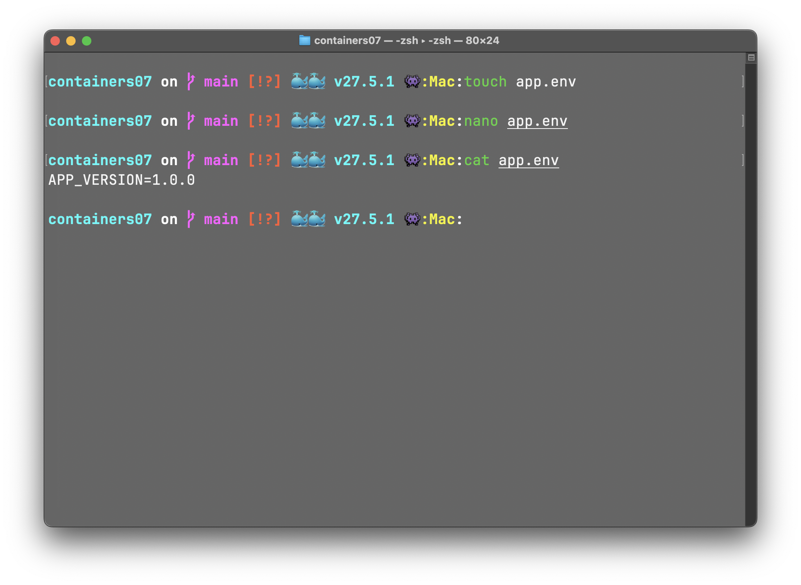   

---

### 7. Запуск контейнеров с помощью Docker Compose

1. **Запуск контейнеров**:  
   - Выполняю:  
     ```bash
     docker-compose up -d
     ```  
   - *Разбор*:  
     Команда `docker-compose up -d` считывает файл `docker-compose.yml`, поднимает необходимые образы, создаёт и запускает контейнеры в фоновом режиме.  
   - *Скриншот*:  
     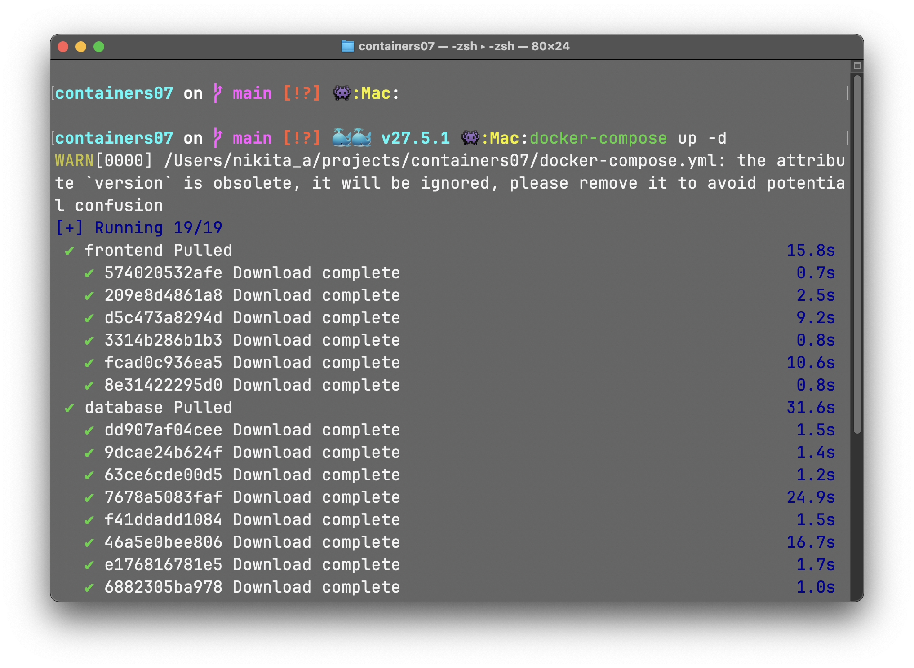  

2. **Проверка работающих контейнеров**:  
   - Выполняю:  
     ```bash
     docker ps
     ```  
   - Ожидается, что будут запущены:  
     - `containers07-frontend-1`  
     - `containers07-backend-1`  
     - `containers07-database-1`  
   - *Скриншот*:  
     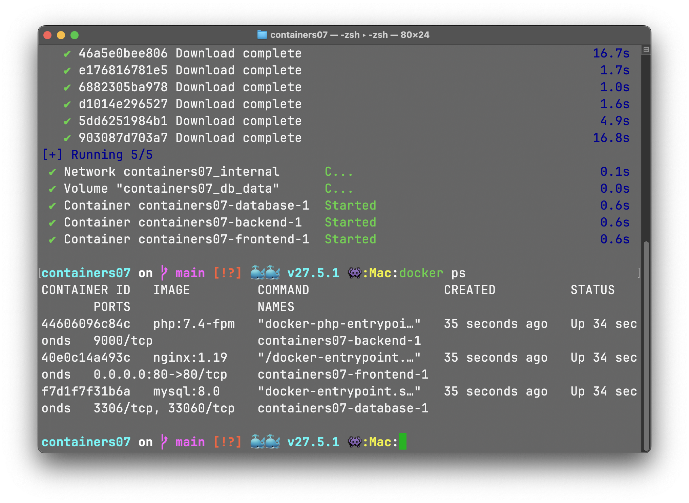  

---

### 8. Проверка работы сайта

1. **Открытие сайта в браузере**:  
   - Перехожу на [http://localhost](http://localhost).  
   - Если отображается базовая страница Nginx или мой PHP-сайт, значит всё настроено верно.  
   - *Скриншот*:  
     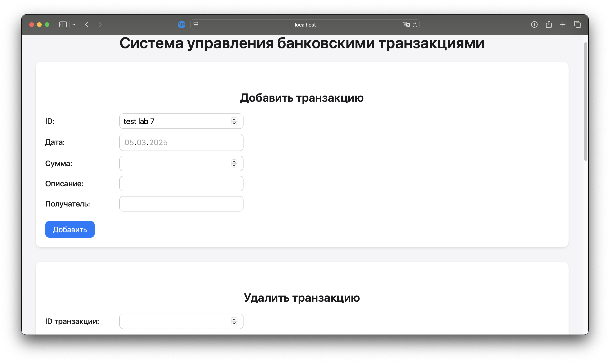  
     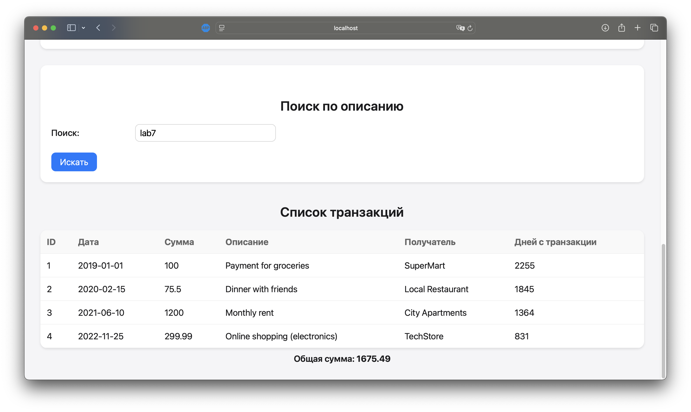

2. **Проверка монтирования**:  
   - Для убеждения, что файлы сайта доступны внутри контейнера:  
     ```bash
     docker exec -it containers07-frontend-1 ls -l /var/www/html
     ```  
   - *Скриншот*:  
     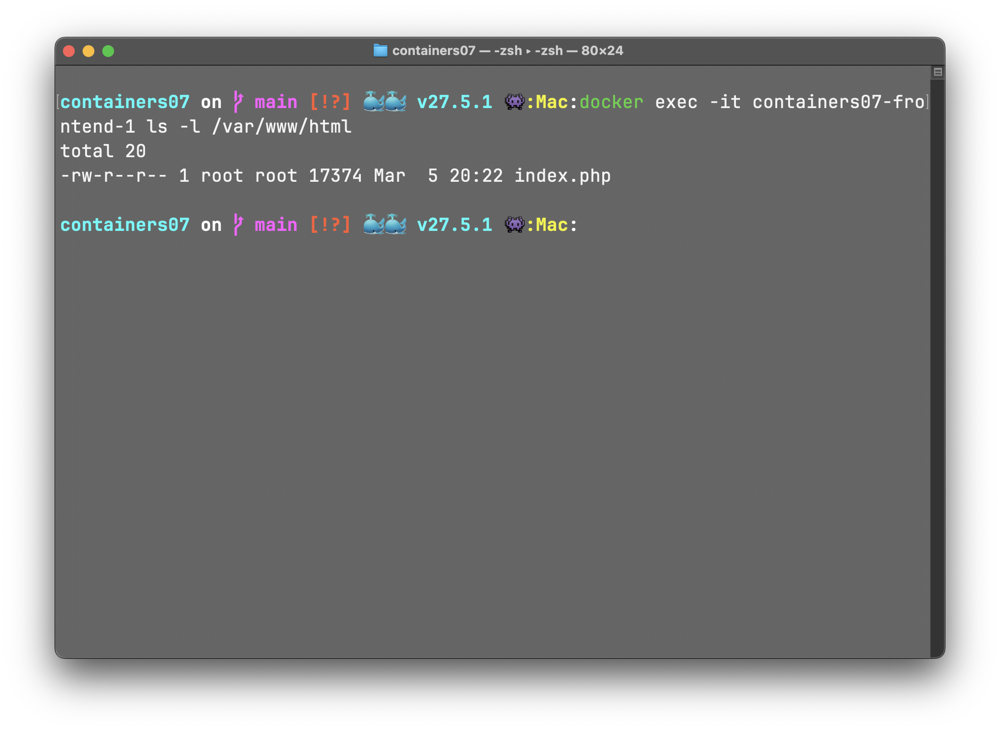  

---

### 9. Ответы на вопросы

1. **В каком порядке запускаются контейнеры?**  
   - Docker Compose запускает контейнеры примерно одновременно, поскольку в файле `docker-compose.yml` не указаны зависимости (`depends_on`). Таким образом, `frontend`, `backend` и `database` стартуют параллельно.  

2. **Где хранятся данные базы данных?**  
   - Данные MySQL сохраняются в томе `db_data`, смонтированном в контейнере `database` по пути `/var/lib/mysql`. Это гарантирует, что данные не будут потеряны при пересоздании контейнера.  

3. **Как называются контейнеры проекта?**  
   - По умолчанию Docker Compose формирует имена, включающие имя проекта (в нашем случае `containers07`), имя сервиса и номер экземпляра:  
     - `containers07-frontend-1`  
     - `containers07-backend-1`  
     - `containers07-database-1`  

4. **Как добавить файл `app.env` с переменной окружения `APP_VERSION` для сервисов backend и frontend?**  
   - Файл `app.env` создан в корне проекта, содержащий:  
     ```env
     APP_VERSION=1.0.0
     ```  
   - В секциях `frontend` и `backend` в файле `docker-compose.yml` добавлен блок `env_file`, включающий этот файл:  
     ```yaml
     env_file:
       - mysql.env
       - app.env
     ```  
   - Это позволяет обоим контейнерам получить переменную `APP_VERSION`.  

---

## Выводы

В результате работы мной было создано многоконтейнерное приложение с использованием **docker-compose**. Были развернуты три сервиса:  
- **Frontend (Nginx)** – отвечает за приём HTTP-запросов и передачу PHP-запросов на backend.  
- **Backend (PHP-FPM)** – выполняет PHP-код, предоставляя динамическое содержимое.  
- **Database (MySQL)** – хранит данные, причём данные базы сохраняются в томе `db_data`, что обеспечивает их сохранность между пересозданиями контейнера.  

**Ключевые моменты**:  
- **Структура проекта**: Создана директория для сайта, что позволяет удобно обновлять код локально.  
- **Конфигурация Nginx**: Файл `nginx/default.conf` настроен так, что запросы на PHP обрабатываются через контейнер `backend` (PHP-FPM).  
- **Docker Compose**: Файл `docker-compose.yml` объединяет три контейнера в одну сеть `internal`, что позволяет им взаимодействовать по именам.  
- **Переменные окружения**: Файлы `mysql.env` и `app.env` используются для передачи настроек в контейнеры, что делает систему более гибкой.  
- **Монтируемые тома**: Тома используются для сохранения данных базы данных, что предотвращает потерю данных при перезапуске контейнеров.  

Таким образом, достигнута цель лабораторной работы – я научился создавать многоконтейнерные приложения с помощью **docker-compose**, настроил взаимодействие между контейнерами, обеспечив их совместную работу для выполнения PHP-приложения.  

---

## Источники

1. [Docker Documentation](https://docs.docker.com/)  
2. [Docker Compose Documentation](https://docs.docker.com/compose/)  
3. [Nginx Documentation](https://nginx.org/en/docs/)  
4. [PHP-FPM Documentation](https://www.php.net/manual/en/install.fpm.php)  
5. [MySQL Official Documentation](https://dev.mysql.com/doc/)  